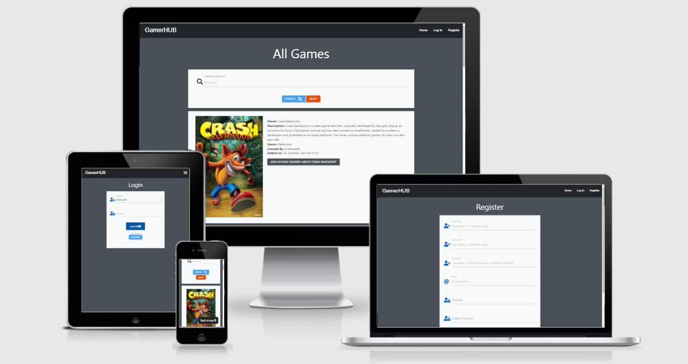
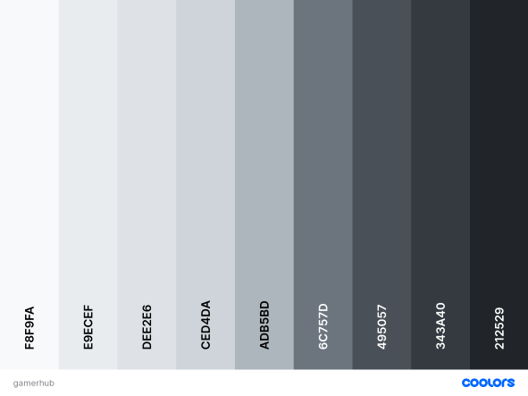

# GamerHUB



[Link to the Live Project](https://gamer-hub-sam.herokuapp.com/).

GamerHUB is a website where users can leave reviews on their favorite video games. All visitors to the website can read these reviews, but only members can add reviews or edit their own review. Registered users can also add, edit and delete their own games. An admin user can add, edit or delete genres.

## Table of contents
1. [UX](#ux)
    1. [Project Goals](#project-goals)
    2. [User Stories](#user-stories)
    3. [Development Planes](#development-planes)
    4. [Changes Made During Project Development](#changes-made-during-project-development)
2. [Features](#features)
    1. [Existing Features](#existing-features)
    2. [Features to Implement in the future](#features-to-implement-in-the-future)
3. [Technologies Used](#technologies-used)
     1. [Languages and Frameworks](#languages-and-frameworks)
     2. [Applications](#applications)
4. [Testing](#testing)
5. [Deployment](#deployment)
     1. [Database Creation](#database-creation)
     2. [Local Copy Creation](#local-copy-creation)
     3. [Heroku App Creation](#heroku-app-creation)
6. [Credits](#credits)
     1. [Images](#images)
     2. [Code](#code)
7. [Acknowledgements](#acknowledgements)
***

## UX 
### Project Goals
The scope of this project is to create a user centric website using the Flask, Python, MongoDB and Heroku.
 
This is my third Milestone Project that must be developed as part of my Full Stack software development course with Code Institute.

The primary goal of the GamerHUB website is to create a community of likeminded people with similar interests to collaborate and share information and experiences with games they have played. Registered users can leave reviews of games they have played.


### User Stories


**As a first time user, I want to:**

1. Easily understand the main purpose of the website.
2. Navigate through the site with ease.
3. See all game reviews.
4. Be able to register and create my own account.


**As a frequent user, I want to:**
1. To search for specific games
2. Login to my own account.
3. Add a game.
4. Add a game review.
5. Edit/delete a game I entered previously.
6. Edit/delete a game review that I had made previously.
7. Logout from my own profile.


**As an admin user, I want to:**
1. Be able to create new genres and also edit and delete them.


### Development Planes

In order to design and create the GamerHUB, the developer distinguished the required functionality of the site and how it would answer the user stories, as described above, using the **Five Development Planes**:

<strong>1. <u>Strategy</u></strong>

The GamerHUB is an online platform to access reviews of various video games with front-end and back-end functionality, developed using HTML, JavaScript, CSS, Python, Flask, and MongoDB. The main objective is to create a platform which is intuitive and allows the user to easily navigate and find reviews for their favourite games.


<strong>2. <u>Scope</u></strong>

The scope was created from using the Strategy previously defined. This allowed us to align the features to deliver on the strategy. This was seperated into two categories:
- **Content Requirements**
     - The player will be looking for:
          - Dynamic and inviting visuals
          - Simple and vibrant content
          

- **Functionality Requirements**
     - The user will be able to:
          - Search with ease using a search bar
          - Log In to their own profile
          - Add their own reviews
          - Access full CRUD functionality


<strong>3. <u>Structure</u></strong>

When looking at my structural plane I wanted to restrict certain functionality depending on the type of user accessing the site.

Visitors (not registered users) will only only have access to the following:

- Game reviews: lists all game reviews that have been added by registered users
- Log-in/Register: invites the visitor to register or login to the website

On top of these pages, a logged in/ registered user will have access to:

My Games: collections of all reviews games left by the user From here, they will be able to edit or delete their games.
Add Review: from here, a user can add a review for a new game or add a new review on an existing game.
Edit: A user will be able to edit their own reviews.
Add Game: from here, a user can add a new game to the list.
Log-out: user can log out of their own profile.

The admin user will also have access to:

Add Genre: the admin will be able to add new genres to be available for users to pick.
Edit/Delete: only admin users will see edit/delete buttons for each genre.


<strong>4. <u>Skeleton</u></strong>

Wireframe mockups were created in a [Figma Workspace](https://www.figma.com/file/2Nn1oK8aWFLJcHwU8yChCI/GamerHUB?node-id=0%3A1 "Link to GamerHUB Figma Workspace") with providing a positive user experience in mind:


<strong>5. <u>Surface</u></strong>

- <strong>Colour Scheme</strong>

     - I used the palette maker from the Coolors website to choose my color scheme.

     - The chosen colour scheme was specifically selected in order to define the tone of the website.

     - A General palette was created, with this atmosphere in mind, and was used in designing graphics and complimentary text colour:

          


- <strong>Typography</strong>

     - The primary font chosen is [Lato](https://fonts.google.com/specimen/Lato). A sans-serif typeface, Lato is geometrically shaped and is easily readable.

     - The charismatic combination of the typefaces compliments the clean aesthetic and entertaining theme set by the colour palette.

### Changes Made During Project Development 
- When looking at the wireframes it is clear to see there was been a few chaanges along the way since the early stages of the idea. I had originally wanted to smaller grids and fit more cards in a row, I decided to change this and add more info in each cards such as "description", "genre", "created by" and "added on" and thus changed to one card per row.

- In the orginal idea I wanted to have a background image but I after some time I went for a simpler plain background inviting the user to focus more on the games and the websites features.

[Back to top ⇧](#table-of-contents)

## Features

 
### Existing Features

- **Navbar** Created using the Materialize CSS framework. Navbar has the title on the left and the menu items on the right hand side. The navbar is fully responsive and changes to match the device screen its being viewed on. Menu items will depend on if the user is a visitor, user or admin.
- **Main content:** This is where the various games will be found and reviews can be accessed.
- **Search Bar:** This will allow the user to find a specific game by name or genre.
- **Flash Messages:** These messages display just below the navbar and give confirmation to the user about actions being completed.
- **Add New Game:** Allows the user to add a new game.
- **Profile:** Allows the user to see their own games and reviews. Users will have the ability to edit and delete games/reviews from this page.
- **LogIn/Register :** Allows the user to login and register for the website.

### Features Left to Implement
- **Donations:** Would allow the user to make donations to the website to support future development.
- **Star Rating:** Users could choose a star rating when adding a game. Or leave a star rating for an existing game.
- **Filter** Filter games be certain criteria such as genre.

## Technologies Used

### Languages and Frameworks

- HTML for main structure of the website.
- CSS to add custom styling to the project.
- [Materialize](https://materializecss.com/) to utilise the grid system and various precoded card panels and buttons
- [JQuery](https://code.jquery.com/) required to use some interactive elements on the materialize
- [Jinja](jinja.palletsprojects.com) to be able to re-use certain elements from similar pages
- [Flask](https://flask.palletsprojects.com/) to be used for the python element of the project

### Applications

- [MongoDB](https://www.mongodb.com/) the database chosen for the project to store all the data.
- [Gitpod](https://gitpod.io/) the development platform for the project.
- [GitHub](https://github.com/) for version control and to store the project after pushing.
- [Heroku](https://www.heroku.com) to deploy the project.
- [Figma](https://figma.com/) used to create the wireframes for the project.
- [Am I Responsive?](http://ami.responsivedesign.is/) Used to generate mockup imagery to be used.

## Testing

[Click here to view the testing for this project!](assets/testing/testing.md)


## Deployment

To further develop this project, a clone can be made using the following steps:
### Database Creation
The application is connected to a [MongoDB Atlas](https://mongodb.com/ "Link to MongoDB Homeapage") Cluster. A Project database can be created using the following steps:

1. Log into [MongoDB](https://account.mongodb.com/account/login "Link to MongoDB login page") or [create an account](https://account.mongodb.com/account/register "Link to MongoDB sign-up page").
2. Locate and select the `New Project` button on the right side of the page, and give your project a name. Navigate to the project page.
3. Locate and select the `Create a New Cluster` button on the right side of the page. Once selected:
     - Choose **Shared Cluster** which is a free option.
     - Select your **Cloud Provider** and **Region** (in this instance: **AWS** and **Ireland**).
     - Click on **Cluster Tier** and select tier of preference (in this instance: **Basic M0 tier**).
     - Click on **Cluster Name** and create your cluster name.
4. Locate and select `Database Access` on the left side of the page. Once selected, click `Add New Database User`:
     - Choose `Password` for the **Authentication Method**
     - Enter a username and password of your choosing
     - Ensure `Read and write to any database` is selected in **Database User Privileges**
     - Add User
5. Locate and select `Network Access` under `Database Access` on the left side of the page. Once selected, click `Add IP Address`:
     - Select `Allow Access from anywhere` (This is not recommended for full-production applications).
     - Select `Confirm`.
6. Locate and select `Clusters` on the left side of the page (must be provisioned first).
7. Click `Collections`, then `+ Create Database` to start adding documents to your database collections:
     - Enter chosen `Database Name`
     - Enter chosen `Collection Name`
     - Select `Create`
8. Click `Create Collection` and create the necessary collections.

### Local Copy Creation
A Local Clone of the repository can be made in two ways:

- **Forking the Repository:**

     By forking the GitHub Repository we make a copy of the original repository on our GitHub account to view and/or make changes without affecting the original repository by using the following steps:

     1. Log into [GitHub](https://github.com/login "Link to GitHub login page") or [create an account](https://github.com/join "Link to GitHub create account page").
     2. Locate the [GitHub Repository](https://github.com/rebeccatraceyt/bake-it-til-you-make-it "Link to GitHub Repo").
     3. At the top of the repository, on the right side of the page, select "Fork".
     4. You should now have a copy of the original repository in your GitHub account.

-  **Creating a Clone**

     How to run this project locally:
     1. Install the [GitPod Browser](https://www.gitpod.io/docs/browser-extension/ "Link to Gitpod Browser extension download") Extension for Chrome.
     2. After installation, restart the browser.
     3. Log into [GitHub](https://github.com/login "Link to GitHub login page") or [create an account](https://github.com/join "Link to GitHub create account page").
     2. Locate the [GitHub Repository](https://github.com/rebeccatraceyt/bake-it-til-you-make-it "Link to GitHub Repo").
     5. Click the green "GitPod" button in the top right corner of the repository.
     This will trigger a new gitPod workspace to be created from the code in github where you can work locally.

     How to run this project within a local IDE, such as VSCode:

     1. Log into [GitHub](https://github.com/login "Link to GitHub login page") or [create an account](https://github.com/join "Link to GitHub create account page").
     2. Locate the [GitHub Repository](https://github.com/rebeccatraceyt/bake-it-til-you-make-it "Link to GitHub Repo").
     3. Under the repository name, click "Clone or download".
     4. In the Clone with HTTPs section, copy the clone URL for the repository.
     5. In your local IDE open the terminal.
     6. Change the current working directory to the location where you want the cloned directory to be made.
     7. Type 'git clone', and then paste the URL you copied in Step 3.
     ```
     git clone https://github.com/USERNAME/REPOSITORY
     ```
     8. Press Enter. Your local clone will be created.

     (Further reading and troubleshooting on cloning a repository from GitHub [here](https://docs.github.com/en/free-pro-team@latest/github/creating-cloning-and-archiving-repositories/cloning-a-repository "Link to GitHub troubleshooting"))

Once a local clone is created, the environment variables have to be set:

1. Create a `.gitignore` file in the project's root directory.
2. In the terminal window, type `touch env.py` to create the file that will contain the environment variables. 
3. Add `env.py` to the `.gitignore` file.
4. Within the `env.py` file, enter the project's environment variables:
```
import os

os.environ.setdefault("IP", "0.0.0.0")
os.environ.setdefault("PORT", "5000")
os.environ.setdefault("SECRET_KEY", <your_secret_key>)
os.environ.setdefault("MONGO_URI", "mongodb+srv://<username>:<password>@<cluster_name>-ocous.mongodb.net/<database_name>?retryWrites=true&w=majority" )
os.environ.setdefault("MONGO_DBNAME", <your_mongo_db_name>)
```
For the `MONGO_URI` ensure to replace `<username>`, `<password>`, `<cluster_name>` and `<database_name>` with the appropriate alternatives.


### Heroku App Creation
The website requires back-end technology, including a server, application and database. It is because of this that the project was deployed on **Heroku**, a container-based cloud Platform as a Service. There are two ways to deploy on Heroku:

- Using the Heroku Command Line Interface
- Connect to GitHub Repository (the developer recommends this method)

Before deployment can be carried out on Heroku, the following steps must be carried out:

1. Create a `requirements.txt` file to install all requirements. In the terminal window, type the following command:
```
pip3 install -r requirements.txt
```
2. Create a `Procfile` file so that Heroku knows which file runs the app. In the terminal window, type the following command:
```
echo web: python app.py > Procfile
```
*Remove the blank line that may occur at the end of the Procfile to avoid any issues*


3. Push the two files to the repository:
```
git add requirements.txt
git commit -m "Add requirements.txt"

git add Procfile 
git commit -m "Add Procfile"

git push
```
Once these steps are completed, continue with the process:

1. Log into [Heroku](https://id.heroku.com/login "Link to Heroku login page") or [create an account](https://signup.heroku.com/login "Link to Heroku sign-up page").
2. Select the `New` button on the top-right of the page, and choose `Create New App`. Give your app a unique name and set the region (in this instance: **Europe**). Then click `Create App`.
3. Navigate to the `Deploy` tab on the dashboard and select `Connect to GitHub`.
4. Search for the repository name (ensuring it is spelled correctly). Once located, click `Connect`. 
5. Navigate to the `Setting` tab on the dashboard and select `Reveal Config Vars`, entering the necessary key/values as below:

| Key | Value |
 --- | ---
IP | 0.0.0.0
PORT | 5000
SECRET_KEY | `<your_secret_key>`
MONGO_URI | `mongodb+srv://<username>:<password>@<cluster_name>-ocous.mongodb.net/<database_name>?retryWrites=true&w=majority`
MONGO_DBNAME | `<your_mongo_db_name>`

6. Navigate back to the `Deploy` tab and scroll down to `Automatic Deploys`.
7. Ensure that the `master` branch is selected, then select `Enable Automatic Deploys`.

Heroku will receive the pushed code from the GitHub repository and host the application with the required packages set out. 

The deployed version can now be viewed by selecting `View App` in the top-right of the page.

[Back to top ⇧](#table-of-contents)

## Credits 

### Images
### Code 
I consulted the following sites to better understand some elements of code:
- [Stack Overflow](https://stackoverflow.com/ "Link to Stack Overflow page")
- [W3Schools](https://www.w3schools.com/ "Link to W3Schools page")
- [Bootstrap](https://getbootstrap.com/ "Link to BootStrap page")
- [Codepen](https://codepen.io/ "Link to Codepen page")
- [JSfiddle](https://jsfiddle.net/ "Link to JSfiddle page")

## Acknowledgements

- I would like to thank my friends and family for their time and opinions on the website.
- I would like to thank my mentor, Seun, for her help and constructive feedback throughout the project.
- I would like to thank the tutors for their guidance on issues throughout the project.

[Back to top ⇧](#table-of-contents)